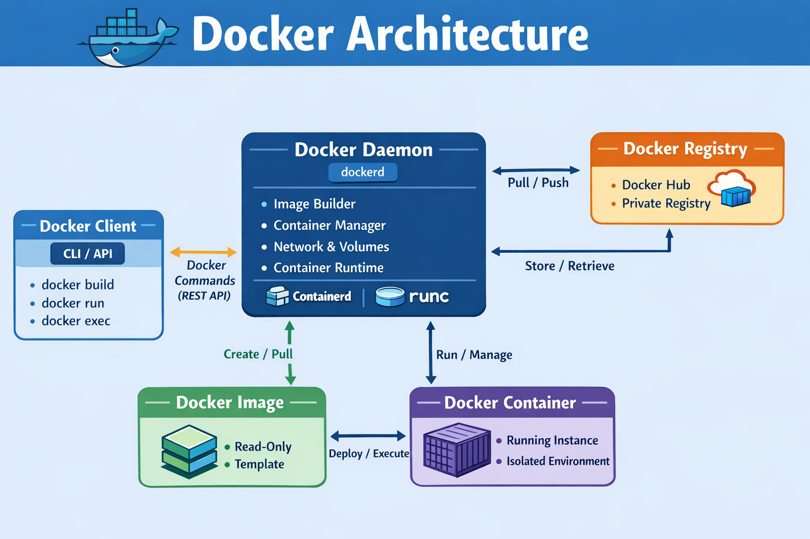
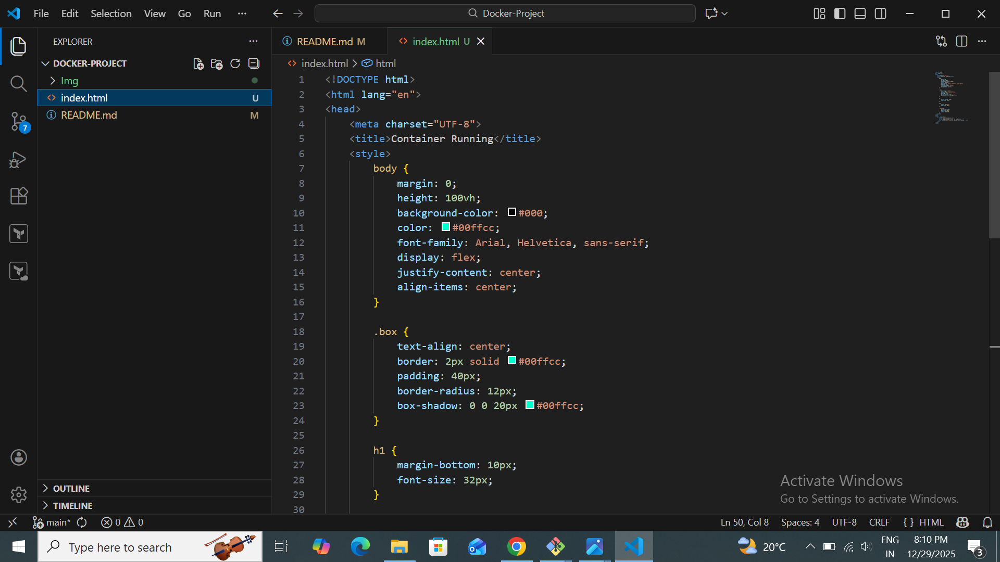
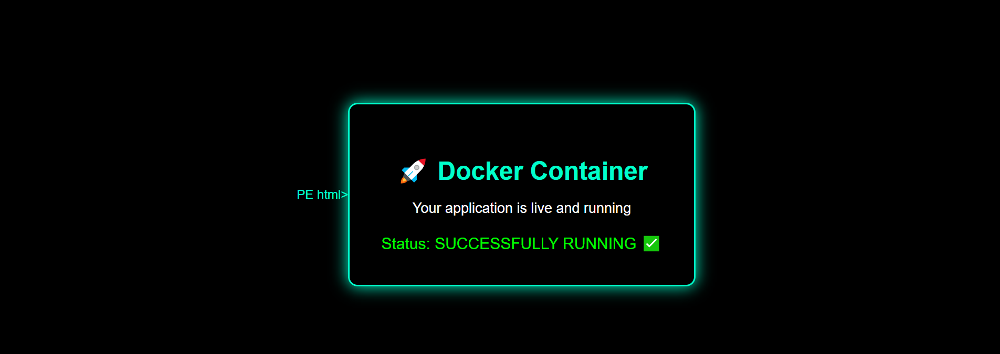

# Docker Nginx Deployment on AWS EC2
## Overview

This project demonstrates how to deploy a Dockerized Nginx web application on an AWS EC2 instance.
It covers EC2 setup, Docker installation, Nginx container deployment, port mapping, and browser access.

## Architecture
    User Browser
     |
     |  HTTP (Port 80)
     |
    ┌───────────────┐
    │   AWS EC2     │
    │  (Linux VM)   │
    │               │
    │  ┌─────────┐  │
    │  │ Docker  │  │
    │  │ Engine  │  │
    │  │         │  │
    │  │ ┌─────┐ │  │
    │  │ │Nginx│ │  │
    │  │ │Cont.│ │  │
    │  │ └─────┘ │  │
    │  └─────────┘  │
    └───────────────┘

The application runs inside a Docker container and is accessible publicly using the EC2 public IP and mapped port.

## Prerequisites

- AWS Account

- EC2 instance (Amazon Linux 2 / Ubuntu)

- Key Pair (.pem)

- Security Group with port 22 & 80 open

- Basic Docker knowledge

## Dockerfile Description
- Uses the official Nginx base image
- Copies the custom HTML file to Nginx web directory
- Serves the application on port 80

## 1. Launch EC2 Instance

- Create EC2

- AMI: Amazon Linux 2

- Instance Type: t2.micro

- Key Pair: Select or create

Security Group:

- SSH → Port 22 → My IP

- HTTP → Port 80 → 0.0.0.0/0

## 2. Connect to EC2 Instance

    ssh -i docker-key.pem ec2-user@<EC2-PUBLIC-IP>
## 3. Install Docker on EC2

       sudo yum update -y
       sudo yum install docker -y
       sudo systemctl start docker
       sudo systemctl enable docker

Add user to docker group:

       sudo usermod -aG docker ec2-user
       exit
## 4. Create Nginx Web App

### index.html

## 5. Build Docker Image
      docker build -t nginx-app .

### Check image:
      docker images

### Port Mapping: -p vs -P

| Option | Description            |
| ------ | ---------------------- |
| -p     | Manual port mapping    |
| -P     | Automatic port mapping |

## 6. Run Nginx Container

### Option 1: Using Fixed Port
    docker run -d -p 80:80 --name nginx-ec2

### Option 2: Using Dynamic Port (-P)

     docker run -d -P --name nginx-ec2

### Check port mapping:
    docker ps
## 7. Access Container using docker exec

      docker exec -it nginx-ec2 /bin/bash
#### Inside container:

    cd /usr/share/nginx/html
    ls
    cat index.html
    exit

### Container Management

    docker stop nginx-ec2
    docker start nginx-ec2
    docker restart nginx-ec2
#### Remove container:
     docker rm -f nginx-ec2

#### Remove image:
     docker rmi nginx-ec2-image

## 8. Access the Application

http://:32772

Example:
http://3.109.123.71:32772

## Screenshots 
- EC2 instance running state

.png)

- Apache HTTPD Default Page Verification

- Application running in browser

## Real-World Use Case

- Hosting static websites

- Microservice frontend

- Dev/Test environments

- CI/CD deployment stage

- Kubernetes Nginx base setup

## Conclusion

This project demonstrates a complete real-world Docker deployment using:

- AWS EC2

- Docker Engine

- Nginx container

- Browser access

## Author

mansi kadam

Github: https://github.com/mansikdam1100

